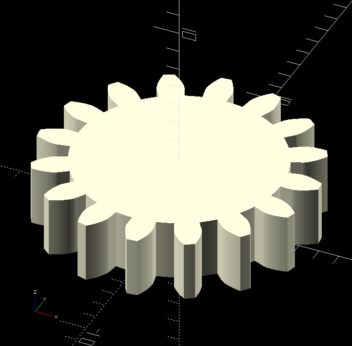
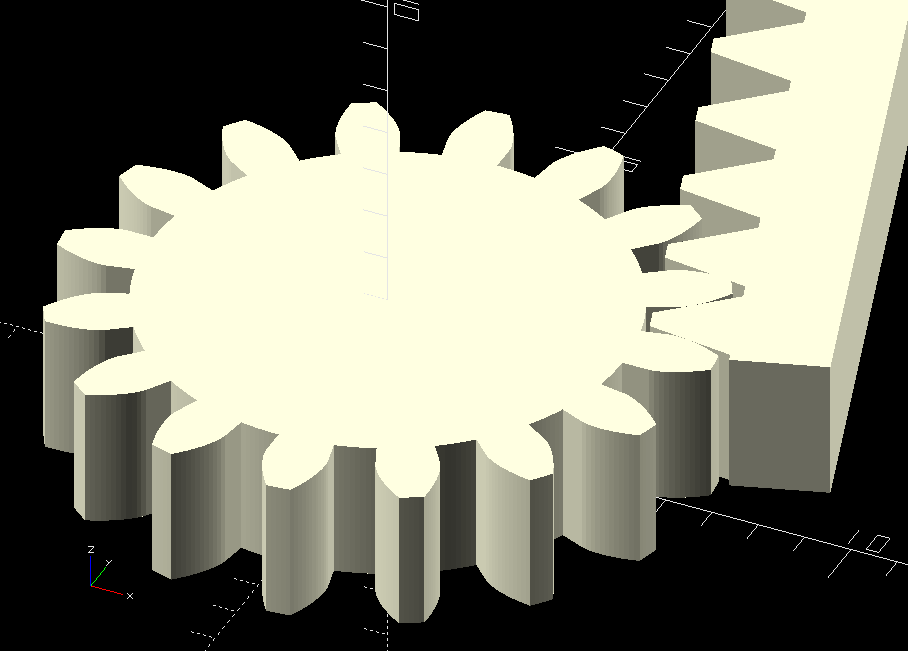
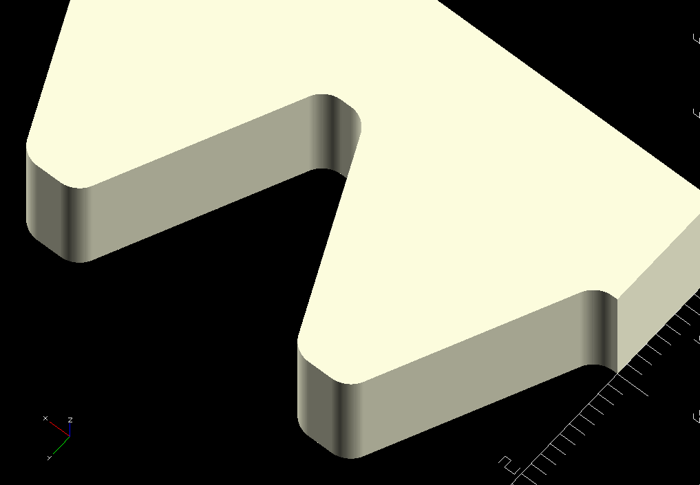
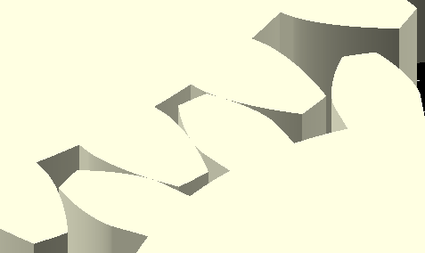
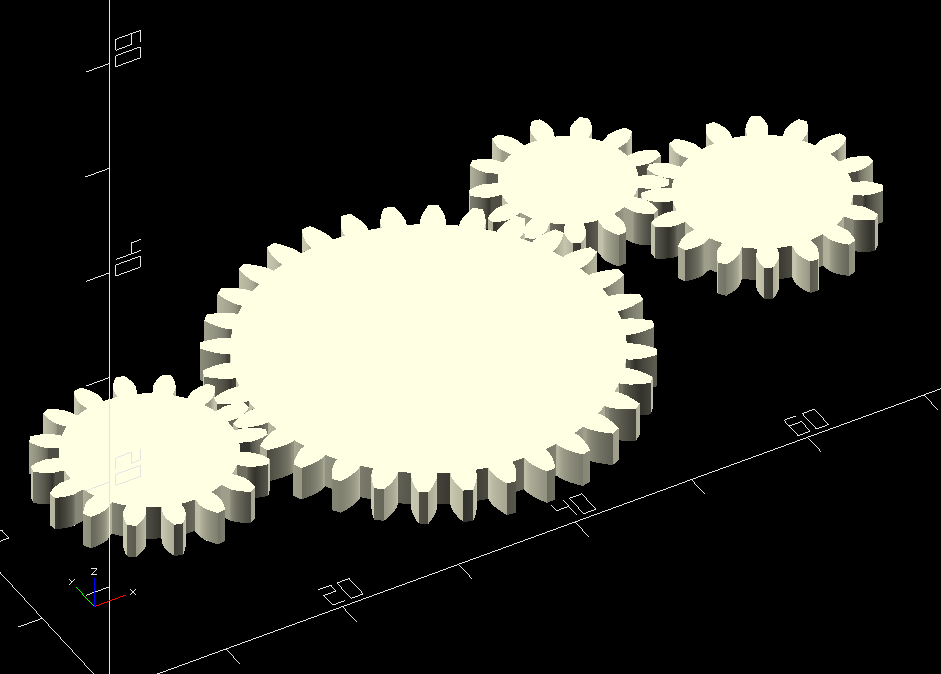

# OpenSCAD_SpurGear
A library for [OpenSCAD][OpenSCAD] to create [spur gear][spur-gear] geometry for [pinions][pinion] and meshing gear racks.

<!--  -->


## Features
- Create pinions and meshing gear racks
- Fast calculations based on analytical formulas and pre-calculation of the intrinsic properties.
- Uniform arc length parametrization used when generating the gear profile (adjustable resolution).
- Built-in helper function to support positioning and orientation of pinions.
- Easy to setup animations with multiple meshing pinions.
- Fillet radius for gear racks (optional).

# Installing the module in OpenSCAD
Clone this repository and copy the folder `OpenSCAD_SpurGear` to the OpenSCAD libraries folder, [read more][OpenSCAD-man-libraries].

In VS Code, install the [OpenSCAD][OpenSCAD-Ext] and [OpenSCAD Language Support][OpenSCAD-Language-Support-Ext] extensions.

## Usage examples

### Create pinion
```scad
use <OpenSCAD_SpurGear/SpurGear.scad>

gear = spur_gear_init(z = 16, m = 1.0, alpha = 20.0);
echo(gear = gear);

pinion_props = spur_gear_pinion_init(gear, w = 3.0, arc_resol = .05);

spur_gear_pinion(pinion_props);
```

### Create gear rack
```scad
use <OpenSCAD_SpurGear/SpurGear.scad>

gear = spur_gear_init(z = 16, m = 1.0, alpha = 20.0);
echo(gear = gear);

gear_rack_props = spur_gear_rack_init(gear, z = 10, width = 3.0, thickness = 2.0);

//translate([0, 3.0, 0])
//rotate([90, 0, 0])
spur_gear_rack(gear_rack_props);
```
It is also possible to add a fillet radius to the gear rack, see example `GearRack_FilletR`. An error is generated if the given radius is too large.



### Positioning of pinion B relative to pinion A
There is no need to guess how much to rotate pinion B to mesh with pinion A.
```scad
spur_gear_pinion(pinion1);
rotate([0, 0, ?])
  spur_gear_pinion(pinion2);
```

Instead, the library provides a function `pinion_position` which returns the 4-by-4 transformation matrix. When applying the matrix using the built-in [`multmatrix`][OpenSCAD-man-multmatrix] function, pinion B will be positioned and oriented properly relative to pinion A along the given direction vector.



It is also possible to link multiple pinions. The position and orientation is calculated within the coordinate frame of the previous (target) pinion.



The implemented pinion positioning algorithm is robust and efficient and re-calculates the pinion configuration on every update. All pinions will therefore be properly aligned upon model changes.

More examples can be found in the `examples` folder.

# Upcoming features
- Position pinion next to a meshing gear rack

# Issues
- Positioning a gear rack in the direction of a pinion fails.

[OpenSCAD]: https://openscad.org/
[OpenSCAD-man]: https://en.wikibooks.org/wiki/OpenSCAD_User_Manual
[OpenSCAD-man-libraries]: https://en.wikibooks.org/wiki/OpenSCAD_User_Manual/Libraries
[OpenSCAD-man-multmatrix]: https://en.wikibooks.org/wiki/OpenSCAD_User_Manual/Transformations#multmatrix
[OpenSCAD-Ext]: https://marketplace.visualstudio.com/items?itemName=Antyos.openscad
[OpenSCAD-Language-Support-Ext]: https://marketplace.visualstudio.com/items?itemName=Leathong.openscad-language-support
[spur-gear]: https://en.wikipedia.org/wiki/Spur_gear
[pinion]: https://en.wikipedia.org/wiki/Pinion
[spur-gears]: https://www.academia.edu/45138344/The_Geometry_of_Involute_Gears
[circle-involute]: https://en.wikipedia.org/wiki/Involute
[circle-spline]: https://www.researchgate.net/publication/220721917_Fair_and_robust_circle_splines
